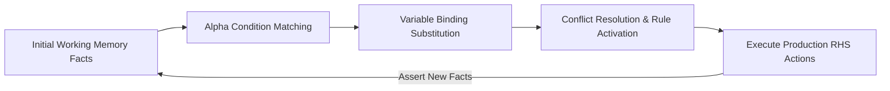

# GenPark Forward Chaining Rete Inference Engine Skill

Forward chaining rule engine with working memory element (WME) pattern matching and fixpoint deduction.

Explore more at [GenPark](https://genpark.ai) and the [GenPark MCP Catalog](https://genpark.ai/mcp).

## Features
- Forward-chaining expert system with fixpoint termination.
- Pattern matching with variable binding.
- Pure Python standard library.
